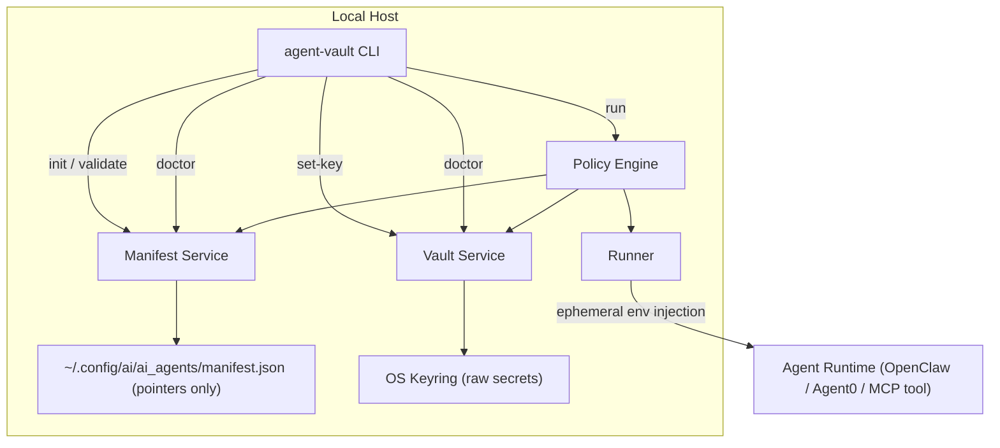

# Agent Vault MVP

Local-first secrets manager for agentic AI tooling. Secrets stay in the OS key vault; a local manifest stores only pointers, routing policy, and runtime metadata.

## Problem

Agent runners and MCP-based workflows need secure access to many credentials:

- LLM upstream providers (OpenAI, Anthropic, Gemini)
- Gateways (OpenRouter, LiteLLM proxy)
- Search and tool APIs
- Sandbox/runtime tokens
- Internal bus tokens for multi-agent communication

The MVP avoids `.env` and plaintext JSON secrets. It uses a pointer model:

- Vault: raw secret values in native OS key vault
- Manifest: metadata + vault lookup keys only

## MVP Scope

### In scope

- Cross-platform CLI (`agent-vault`)
- Manifest bootstrap and validation
- Interactive secret set/get via OS keyring
- Ephemeral injection into child process environment only
- Provider selection policy (priority/fallback)
- Basic health checks (`doctor` command)
- Local dashboard + localhost API for provider and manifest management

### Out of scope

- Hosted control plane
- Team RBAC and org-wide audit logs
- Automatic rotation integrations with every provider
- Internet-exposed dashboard hosting

## Technology Stack

Full details: [`docs/technology-stack.md`](docs/technology-stack.md)
Secret lifecycle deep dive: [`docs/secret-lifecycle.md`](docs/secret-lifecycle.md)

- Language: Python 3.12
- CLI framework: Typer
- Terminal UX: Rich
- Secrets backend abstraction: keyring
- Data validation: Pydantic v2
- Testing: pytest + pytest-cov
- Quality: Ruff + mypy
- Packaging/Env: Poetry (central virtualenvs, no in-project `.venv`)

## Quickstart

### Prerequisites

1. Python 3.12+
2. `pip`, `pipx`, or Poetry
3. OS keychain backend available for `keyring` (Keychain, Credential Manager, or Secret Service)

### Install

Install from local source with `pip`:

```bash
python -m pip install .
```

Or install isolated with `pipx`:

```bash
pipx install .
```

For development workflows, keep using Poetry:

```bash
poetry install
```

### First run (CLI + dashboard)

```bash
agent-vault init
agent-vault set-key openai_pro
agent-vault doctor
agent-vault dashboard --open-browser
```

### First run (CLI-only)

```bash
agent-vault init
agent-vault set-key openai_pro
agent-vault run --provider openai_pro -- "env | grep OPENAI_API_KEY"
```

### What you should see

1. Manifest at `~/.config/ai/ai_agents/manifest.json`
2. Secret persisted in OS vault, not in manifest
3. `doctor` passes when required keys and endpoints are available
4. Dashboard at `http://127.0.0.1:8765` with a startup write token

## Folder Structure

```text
.
|-- README.md
|-- pyproject.toml
|-- Makefile
|-- .gitignore
|-- src/
|   `-- agent_vault/
|       |-- __init__.py
|       |-- __main__.py
|       |-- cli.py
|       |-- config.py
|       |-- models.py
|       |-- manifest.py
|       |-- api.py
|       |-- service.py
|       |-- vault.py
|       |-- policy.py
|       `-- runner.py
|-- tests/
|   |-- unit/
|   |   |-- test_api.py
|   |   |-- test_manifest.py
|   |   `-- test_policy.py
|   `-- integration/
|       `-- test_cli_init.py
|-- docs/
|   |-- architecture.md
|   |-- api.md
|   |-- secret-lifecycle.md
|   |-- technology-stack.md
|   `-- adr/
|       `-- 0001-local-first-keyring.md
|-- examples/
|   `-- manifest.example.json
|-- scripts/
|   `-- bootstrap.sh
`-- .github/
    `-- workflows/
        `-- ci.yml
```

## Application Diagram



## Core MVP Flows

## CLI Commands

| Command | Purpose | Key arguments/options | Example |
|---|---|---|---|
| `agent-vault init` | Create default manifest if missing | none | `poetry run agent-vault init` |
| `agent-vault set-key <provider>` | Store provider secret in OS keyring | `provider` (required) | `poetry run agent-vault set-key openai_pro` |
| `agent-vault doctor` | Validate manifest, key presence, and endpoint reachability | none | `poetry run agent-vault doctor` |
| `agent-vault run "<command>"` | Execute command with ephemeral secret injection | `--provider` (optional override) | `poetry run agent-vault run --provider openai_pro -- "openclaw gateway start"` |
| `agent-vault dashboard` | Start local dashboard/API server on loopback | `--host`, `--port`, `--open-browser`, `--auth-token` | `poetry run agent-vault dashboard --open-browser` |

### 1) Initialize project state

```bash
poetry run agent-vault init
```

Creates:

- `~/.config/ai/ai_agents/manifest.json` (if missing)
- Local config directory with safe permissions

### 2) Save a provider key

```bash
poetry run agent-vault set-key openai_pro
```

- Reads provider from manifest
- Prompts with hidden input
- Stores key in OS vault under service namespace `agent_vault`

### 3) Launch agent runtime with ephemeral injection

```bash
poetry run agent-vault run --provider openai_pro -- "openclaw gateway start"
```

- Resolves provider policy
- Fetches secret from keyring at runtime
- Injects into child process env only
- Parent shell remains clean

### 4) Validate runtime readiness

```bash
poetry run agent-vault doctor
```

Checks:

- Manifest exists and validates
- Required providers have reachable vault entries
- Local endpoints (like Ollama) are reachable if configured

### 5) Run local dashboard and API

```bash
poetry run agent-vault dashboard --open-browser
```

- Binds to loopback only by default (`127.0.0.1`)
- Prints an API write token (send as `X-Agent-Vault-Token`)
- Opens dashboard at `http://127.0.0.1:8765`

## API Module Deep Dive (`src/agent_vault/api.py`)

Detailed request/response documentation with copy-paste examples is available in [`docs/api.md`](docs/api.md).

### Purpose

`api.py` exposes a local HTTP interface and a lightweight browser dashboard over the same service layer used by CLI commands. It keeps security assumptions local-first:

1. Loopback deployment via `agent-vault dashboard`
2. Read endpoints open locally
3. Mutating endpoints protected by `X-Agent-Vault-Token`

### App construction

`create_app(service: AgentVaultService, auth_token: str) -> FastAPI` is the entrypoint.

1. Receives a preconfigured `AgentVaultService` from the CLI.
2. Receives the dashboard token generated in `cli.py`.
3. Registers REST endpoints and root HTML dashboard (`GET /`).

### Auth and trust model

1. `require_write_token` validates `X-Agent-Vault-Token` using constant-time comparison.
2. Mutating endpoints are gated: `POST /providers/{provider}/secret`, `DELETE /providers/{provider}/secret`, `PUT /manifest`.
3. Read/test endpoints are not token-gated: `GET /health`, `GET /providers`, `POST /providers/{provider}/test`, `GET /manifest`.

### Error handling strategy

`run_service_call(...)` maps domain errors to HTTP:

1. `ManifestError` -> `400`
2. `ServiceError` -> `400`
3. `VaultError` -> `500`

This keeps API responses deterministic while preserving service-level logic in `service.py`.

### Endpoint reference

1. `GET /health`: returns `{"status":"ok"}`.
2. `GET /providers`: returns provider metadata plus `has_secret` and `endpoint_reachable`.
3. `POST /providers/{provider}/secret` (token required): accepts `{"secret":"..."}` and stores or rotates provider secret in OS vault.
4. `DELETE /providers/{provider}/secret` (token required): deletes provider secret from OS vault.
5. `POST /providers/{provider}/test`: returns provider test result (`ok`, failure reasons).
6. `GET /manifest`: returns full manifest JSON.
7. `PUT /manifest` (token required): accepts `{"manifest": <Manifest object>}`, validates it, and writes the manifest.

### Manual API examples

Set shell variables from dashboard startup output:

```bash
export AV_BASE="http://127.0.0.1:8765"
export AV_TOKEN="<token printed by dashboard command>"
```

Read providers:

```bash
curl -s "$AV_BASE/providers"
```

Rotate a secret:

```bash
curl -s -X POST "$AV_BASE/providers/openai_pro/secret" \
  -H "Content-Type: application/json" \
  -H "X-Agent-Vault-Token: $AV_TOKEN" \
  -d '{"secret":"sk-..."}'
```

Update manifest:

```bash
curl -s -X PUT "$AV_BASE/manifest" \
  -H "Content-Type: application/json" \
  -H "X-Agent-Vault-Token: $AV_TOKEN" \
  -d @manifest-update.json
```

### UI relationship to API

The dashboard page (`GET /`) is a thin client that calls the same endpoints above. No secret value is read back from vault; UI only sees status booleans and operation success/failure.

## Manifest Design

- Manifest location: `~/.config/ai/ai_agents/manifest.json`
- Contains metadata only, never raw secret values
- Secret pointer lives in `vault_key`

See reference example: [`examples/manifest.example.json`](examples/manifest.example.json)

## Security Principles

- No plaintext secret files
- No long-lived env exports
- Inject secrets only into short-lived child processes
- Validate required secrets before launch
- Keep runtime logs redacted

For full flow details, see [`docs/secret-lifecycle.md`](docs/secret-lifecycle.md).

## Development

### Setup

```bash
poetry config virtualenvs.in-project false
# expected: false
poetry install
```

Policy: in-project `.venv` is not allowed for this repository.

### Common commands

```bash
make lint
make typecheck
make test
```

## MVP Milestones

1. CLI scaffold and manifest validation
2. Vault integration and provider policy
3. Runner with ephemeral env injection
4. Doctor checks + integration tests
5. Packaging + CI hardening

## Next Step After MVP

- Introduce optional centralized backend (Infisical/Vault) while keeping local manifest + runtime API stable.
